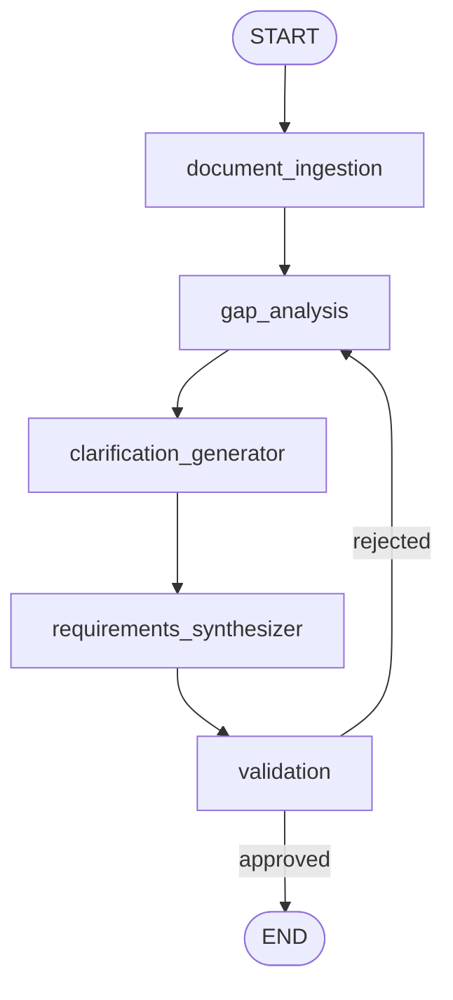
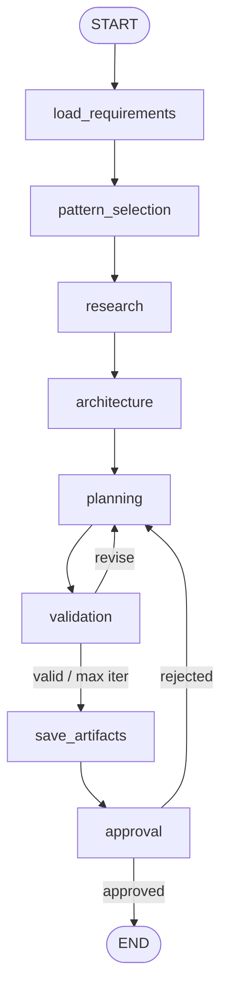
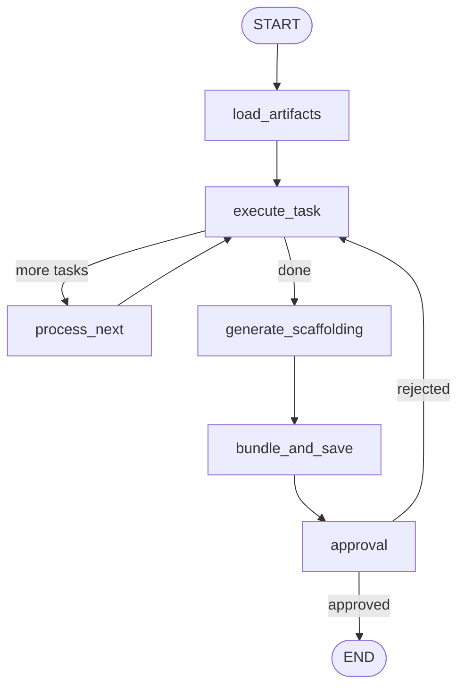

# AI Agent Factory v2

**Document-driven, pattern-aware code generator** — a backend service that turns uploaded project documents (BRD/PRD/TRD) into validated requirements, an architecture plan, and a runnable codebase, with human-in-the-loop (HITL) approval at every stage.

---

## Table of Contents

- [What It Is](#what-it-is)
- [Why It Exists](#why-it-exists)
- [How It Works](#how-it-works)
- [Architecture](#architecture)
- [Workflows](#workflows)
  - [1. Requirements Workflow](#1-requirements-workflow)
  - [2. Planning Workflow](#2-planning-workflow)
  - [3. Codegen Workflow](#3-codegen-workflow)
- [Agents at a Glance](#agents-at-a-glance)
- [API Surface](#api-surface)
- [Getting Started (Local Setup)](#getting-started-local-setup)
- [Running Tests](#running-tests)
- [Project Structure](#project-structure)

---

## What It Is

AI Agent Factory v2 is a **FastAPI + LangGraph** application. You create a project, upload documents, and then run three sequential workflows:

1. **`requirements`** — ingests documents, finds gaps, asks you clarifying questions, synthesizes a requirements document, and asks for your approval.
2. **`planning`** — selects agentic design patterns, researches (documents + knowledge base + web), designs architecture, creates a task plan, validates it, and asks for your approval.
3. **`codegen`** — generates code task-by-task with a developer agent, reviews it in parallel with three reviewer agents, scaffolds the project (`requirements.txt`, `main.py`, `__init__.py`), bundles everything, and asks for your approval.

Each workflow is a **compiled LangGraph `StateGraph`** with persistent SQLite checkpoints, so runs can pause at interrupts, resume after human input, and survive restarts.

## Why It Exists

Manual software planning is slow, inconsistent, and easy to get wrong. This project automates the path from **raw documents → validated requirements → architecture & task plan → reviewed, runnable code**, while keeping a human in the loop for every consequential decision:

- **Documents as the source of truth** — RAG over uploaded files, not hallucinated requirements.
- **Pattern-aware generation** — 12 seeded agentic design patterns and 10 common design patterns guide architecture and code structure.
- **Multi-agent review** — generated code is checked by workflow, prompt, and security reviewers in parallel before it is accepted.
- **HITL gates** — clarifications and approvals pause the graph; nothing advances without a decision (or explicit max-iteration fallback).
- **Observability** — OpenTelemetry traces, structured logs, token/cost accounting, and SSE event streams per run.

## How It Works

```text
POST /auth/register  →  POST /auth/login  →  JWT token
        ↓
Create project  →  Upload documents (PDF/DOCX/PPTX/XLSX/MD/TXT)
        ↓
POST /projects/{id}/workflows/requirements   (202 Accepted, async run)
        ↓  (SSE events + HITL interrupts)
POST /projects/{id}/workflows/planning
        ↓
POST /projects/{id}/workflows/codegen
        ↓
Download artifacts / bundle  (GET .../artifacts)
```

- Triggers return **202** immediately; work runs in a background `asyncio` task.
- Only **one active run per project** (second trigger → **409 Conflict**); `idempotency_key` is supported.
- Progress is streamed via **SSE** (`GET /projects/{pid}/runs/{rid}/events`); blocking questions arrive over **REST APIs** (`/projects/{pid}/runs/{rid}/hitl?token=<jwt>`).
- After each run, a report is generated (`report_service`).

## Architecture

```text
┌─────────────────────────────────────────────────────────────┐
│                        FastAPI app                          │
│  routers: auth, health, projects, documents, patterns,      │
│           runs, tasks, workflows, observability             │
│  WS: /projects/{pid}/runs/{rid}/hitl                        │
│  UI: /ui  ·  /node  ·  OpenAPI: /docs                       │
├─────────────────────────────────────────────────────────────┤
│  LangGraph workflows (SQLite checkpointer)                  │
│    requirements  →  planning  →  codegen                    │
├────────────────────────dl──────────────────────────────────┤
│  LLM: Groq via ChatGroq (GROQ_API_KEY, LLM_MODEL)           │
│  RAG: Chroma + embeddings (documents / pattern KB)           │
│  Web: DuckDuckGo search (no API key)                         │
│  Auth: JWT (python-jose)  ·  DB: async SQLAlchemy + aiosqlite│
│  Observability: OpenTelemetry + structlog                    │
└─────────────────────────────────────────────────────────────┘
```

- **Entry point:** `uvicorn src.main:app` (see `src/main.py`).
- **Graph inspection:** `GET /workflows`, `GET /workflows/{name}/graph`, `.../graph.png`, `.../graph.mermaid`.
- **Patterns:** 12 patterns seeded idempotently at startup from `src/seeds/patterns.yaml`.

---

## Workflows

### 1. Requirements Workflow

Turns uploaded documents into a validated requirements document (Markdown + JSON), with gap-driven clarifications.

**Graph nodes:** `document_ingestion → gap_analysis → clarification_generator → requirements_synthesizer → validation`  
**Interrupts (before):** `clarification_generator`, `validation`  
**Conditional:** `validation` → `rejected` loops back to `gap_analysis`, otherwise `END`.




| Node | What it does |
|------|----------------|
| **document_ingestion** | Loads all `ready` documents for the project from the DB and attaches section metadata. |
| **gap_analysis** | Runs RAG similarity against category templates (functional/NFR, personas, deployment, …) to list gaps; incorporates reviewer `feedback` on re-runs. |
| **clarification_generator** | **HITL interrupt.** Turns gaps into clarification questions for the human (via WebSocket / resume API). |
| **requirements_synthesizer** | Merges document content + clarifications into `requirements_md` and structured `requirements_json`. |
| **validation** | **HITL interrupt / gate.** Human approves or rejects with feedback; rejection loops back to gap analysis (max 3 clarification rounds). |

**Agents/nodes** live in `src/workflows/requirements/nodes.py`; graph wiring in `src/workflows/requirements/graph.py`.

---

### 2. Planning Workflow

Consumes approved requirements and produces patterns, research findings, architecture, and a validated task plan.

**Graph nodes:** `load_requirements → pattern_selection → research → architecture → planning → validation → save_artifacts → approval`  
**Conditional:** `validation` → pass or max-iterations → `save_artifacts`, else revise `planning`; `approval` → rejected loops to `planning`, else `END`.  
**Interrupt (in-node):** `approval` uses `langgraph.types.interrupt`.




| Node | Agent / role |
|------|----------------|
| **load_requirements** | Loads the latest completed `requirements` run’s artifacts for the project (10s DB timeout guard). |
| **pattern_selection** | **Pattern Selector agent** — chooses applicable patterns from the seeded knowledge base (LLM or rule-based fallback). |
| **research** | **Researcher agent** — RAG over documents `[doc:]`, pattern KB `[kb:]`, DuckDuckGo web `[web:]`, LLM `[llm]`; every claim is cited. |
| **architecture** | **Architect agent** — designs `architecture_md` + `architecture_json` from patterns + research. |
| **planning** | **Planner agent** — breaks architecture into ordered tasks with IDs, titles, and acceptance criteria. |
| **validation** | **Critic agent** — scores the plan; iterates up to `max_iterations` (3) before proceeding. |
| **save_artifacts** | Persists patterns, research, architecture, and tasks via `artifact_service`. |
| **approval** | **HITL interrupt** — human approves or rejects with feedback; rejection returns to `planning`. |

**Agents** in `src/workflows/planning/agents/` (`pattern_selector.py`, `researcher.py`, `architect.py`, `planner.py`, `critic.py`); graph in `src/workflows/planning/graph.py`. All planning agents use **ChatGroq** when `GROQ_API_KEY` is set and **rule-based fallbacks** otherwise.

---

### 3. Codegen Workflow

Loads approved planning artifacts and generates code task-by-task with review loops, then scaffolds and bundles the project.

**Graph nodes:** `load_artifacts → execute_task ⇄ process_next → generate_scaffolding → bundle_and_save → approval`  
**Conditional:** `execute_task` routes to `process_next` while tasks remain, else `generate_scaffolding`; `approval` rejected → `execute_task`, else `END`.




| Node | What it does |
|------|----------------|
| **load_artifacts** | Loads the latest completed `planning` run (requirements, architecture, patterns, tasks). |
| **execute_task** | Runs the **task subgraph** for the current task (see below) and appends generated files to the workspace. |
| **process_next** | Advances `current_task_index` and loops back. |
| **generate_scaffolding** | Auto-generates `requirements.txt` (AST import scan + framework detect), `main.py`, and package `__init__.py` files. |
| **bundle_and_save** | Writes all files to disk and creates a downloadable bundle (manifest + zip). |
| **approval** | **HITL interrupt** — human approves the bundle or rejects with feedback (re-enters task execution). |

**Task subgraph** (`src/workflows/codegen/subgraph_builder.py`):

```text
developer → validate_code → parallel_reviewers (workflow · prompt · security) → reduce_reviews
                ↑                                              │
                └──────────── revise (max 3 iterations) ◄──────┘
```

| Agent | Role |
|-------|------|
| **Developer** (`agents/developer.py`) | Senior-dev prompt: complete, self-contained, runnable Python; no stubs; honors selected patterns and dependencies. |
| **Validate code** | Syntax (`compile`) + third-party import checks; failures short-circuit with feedback. |
| **Workflow reviewer** | Checks orchestration/state/tool/error-handling matches selected patterns. |
| **Prompt reviewer** | Checks prompt clarity, role definitions, injection resistance, input sanitization. |
| **Security reviewer** | OWASP basics: input validation, no hardcoded secrets, safe errors, path traversal, authz. |
| **Reduce reviews** | Combines verdicts: all pass → done; any fail → feedback to developer (until `max_iterations`). |

---

## Agents at a Glance

| Workflow | Agent / node | File |
|----------|--------------|------|
| Requirements | document_ingestion, gap_analysis, clarification_generator, requirements_synthesizer, validation | `src/workflows/requirements/nodes.py` |
| Planning | Pattern Selector | `src/workflows/planning/agents/pattern_selector.py` |
| Planning | Researcher (doc RAG + KB RAG + web + LLM, citations) | `src/workflows/planning/agents/researcher.py` |
| Planning | Architect | `src/workflows/planning/agents/architect.py` |
| Planning | Planner | `src/workflows/planning/agents/planner.py` |
| Planning | Critic (plan validation) | `src/workflows/planning/agents/critic.py` |
| Codegen | Developer | `src/workflows/codegen/agents/developer.py` |
| Codegen | Workflow / Prompt / Security reviewers | `src/workflows/codegen/agents/reviewers.py` |


---

## API Surface

| Method | Path | Purpose |
|--------|------|---------|
| POST | `/auth/register`, `/auth/login` | JWT auth |
| GET | `/healthz` | Health check |
| CRUD | `/projects`, `/projects/{id}/documents` | Projects & uploads |
| GET | `/patterns` | Seeded pattern library |
| POST | `/projects/{id}/workflows/{type}` | Trigger `requirements` \| `planning` \| `codegen` (202) |
| GET | `/projects/{id}/runs`, `/runs/{rid}` | Run status |
| GET | `/workflows`, `/workflows/{name}/graph[.png\|.mermaid]` | Graph metadata & diagrams |
| GET | `/projects/{id}/runs/{rid}/artifacts[/{file}]` | Download artifacts / bundle |
| GET | `/observability/...` | Traces / metrics / reports |

Full OpenAPI docs: **`/docs`** (Swagger) · UI: **`/ui`** · Node UI: **`/node`**

---

## Getting Started (Local Setup)

### Prerequisites

- **Python 3.11+** (developed on 3.12)
- **Git**
- A **Groq API key** (free tier works) — [console.groq.com](https://console.groq.com)

### 1. Clone the repository

```bash
git clone git@github.com:Saksham1750/agentic_workflow.git
cd agentic_workflow
```

### 2. Create a virtual environment

```bash
python -m venv .venv

# Windows
.venv\Scripts\activate

# macOS / Linux
source .venv/bin/activate
```

### 3. Install dependencies

```bash
pip install -e ".[dev]"
```

This installs runtime deps from `pyproject.toml` (FastAPI, LangChain, LangGraph, ChromaDB, etc.) plus dev tools (`pytest`, `pytest-asyncio`, `pytest-cov`).

### 4. Configure environment

```bash
cp .env.example .env
```

Edit `.env` and set at least:

```bash
GROQ_API_KEY=gsk_your_groq_api_key_here
LLM_MODEL=qwen/qwen3.8-27b
JWT_SECRET=change-this-in-production
```

> **Note:** The application reads **`GROQ_API_KEY`** (see `src/config.py`). The `OPENAI_API_KEY` entry in `.env.example` is a legacy placeholder — use `GROQ_API_KEY`. Without an API key, planning/codegen agents fall back to deterministic rule-based logic; LLM quality requires a key.

### 5. Run the server

```bash
uvicorn src.main:app --reload
```

Or:

```bash
python -m uvicorn src.main:app --reload --host 0.0.0.0 --port 8000
```

On startup the app will:

- initialize SQLite DBs (`./data/app.db`, `./data/checkpoints.sqlite`)
- create `./data` and Chroma persist dirs
- seed the 12 design patterns

Open:

- API docs: <http://127.0.0.1:8000/docs>
- Web UI: <http://127.0.0.1:8000/ui>
- Health: <http://127.0.0.1:8000/healthz>

### 6. Smoke test (optional)

```bash
# Register & login
curl -s -X POST http://127.0.0.1:8000/auth/register \
  -H "Content-Type: application/json" \
  -d '{"email":"dev@example.com","password":"secret123"}'

curl -s -X POST http://127.0.0.1:8000/auth/login \
  -H "Content-Type: application/json" \
  -d '{"email":"dev@example.com","password":"secret123"}'
# → {"access_token": "...", "token_type": "bearer"}

# List workflows (use token from login)
curl -s http://127.0.0.1:8000/workflows \
  -H "Authorization: Bearer $TOKEN"
```

Then create a project, upload documents, and trigger workflows through `/docs` or the UI at `/ui`.

---

## Running Tests

```bash
pytest
```

Test path is configured as `tests/` in `pyproject.toml`. Coverage:

```bash
pytest --cov=src
```

---

## Project Structure

```text
.
├── README.md
├── pyproject.toml              # deps, dev extras, pytest config
├── .env.example                # env template
├── docs/graphs/                # workflow diagram PNGs (mermaid)
│   ├── requirements_graph.png
│   ├── planning_graph.png
│   └── codegen_graph.png
├── static/                     # UI pages (/ui, /node)
├── src/
│   ├── main.py                 # FastAPI app, routers, WS, lifespan
│   ├── config.py               # Settings (GROQ_API_KEY, LLM_MODEL, …)
│   ├── routers/                # auth, projects, documents, runs, workflows, …
│   ├── services/               # artifact, run, sse, report, seed, rag, …
│   ├── models/                 # SQLAlchemy models
│   ├── schemas/                # Pydantic schemas (incl. hitl)
│   ├── websockets/hitl.py      # HITL connection manager
│   ├── seeds/patterns.yaml     # 12 design patterns
│   ├── observability/          # OTEL setup, tracing, token callback, logging
│   └── workflows/
│       ├── requirements/       # graph.py, nodes.py, state.py
│       ├── planning/           # graph.py + agents/
│       ├── codegen/            # graph.py, subgraph_builder.py, agents/, services/
│       └── checkpointer.py     # SQLite checkpointer
└── tests/                      # pytest suite
```

---

## Regenerating Workflow Diagrams

The PNGs under `docs/graphs/` are rendered from the compiled LangGraph graphs:

```bash
python - <<'PY'
import asyncio, pathlib
async def main():
    out = pathlib.Path("docs/graphs"); out.mkdir(parents=True, exist_ok=True)
    from src.workflows.requirements.graph import build_requirements_graph
    from src.workflows.planning.graph import build_planning_graph
    from src.workflows.codegen.graph import build_codegen_graph
    for name, build in [
        ("requirements_graph", build_requirements_graph),
        ("planning_graph", build_planning_graph),
        ("codegen_graph", build_codegen_graph),
    ]:
        g = await build()
        (out / f"{name}.png").write_bytes(g.get_graph().draw_mermaid_png())
        print("wrote", name)
asyncio.run(main())
PY
```

You can also fetch live diagrams from the API: `GET /workflows/{name}/graph.png` or `GET /workflows/{name}/graph.mermaid` (authenticated).

---

